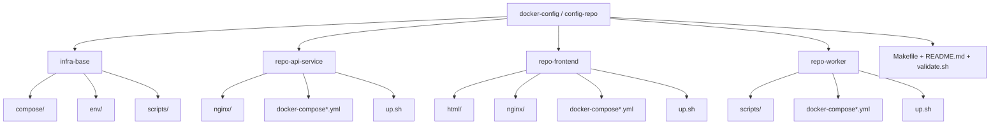
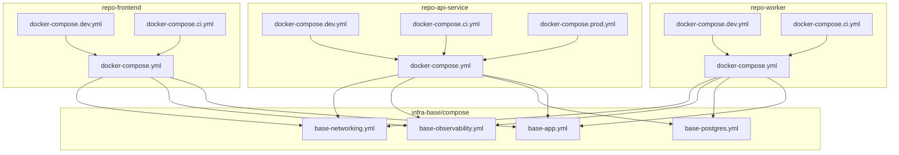
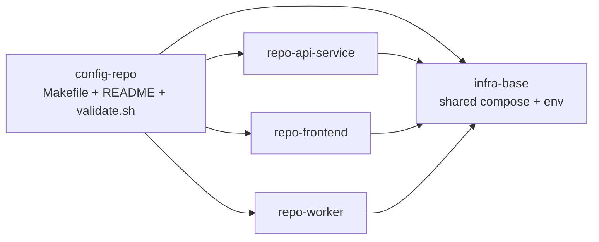
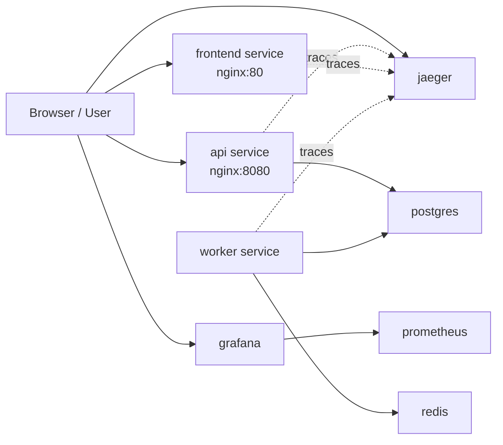
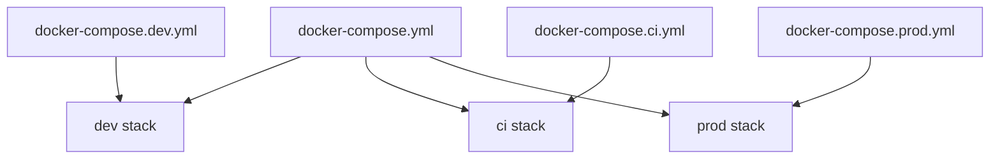
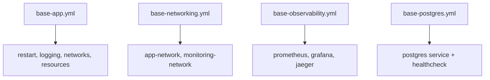

# config-repo Workspace

This root folder is best treated as a `config-repo`: a workspace and orchestration repo that sits above the real application repos.

The child repos stay independent git repositories:

- `infra-base`
- `repo-api-service`
- `repo-frontend`
- `repo-worker`

The root repo should track only workspace-level files such as:

- `Makefile`
- `README.md`
- `validate.sh`
- root ignore files

It should ignore the child repo folders themselves. That preserves your prerequisite that the sub repos remain real repos with their own history and remotes.

`infra-base` owns the shared infrastructure building blocks. The three app repos consume those shared files through sibling paths such as `../infra-base/compose/base-app.yml`. The shared observability layer includes Prometheus, Grafana, and Jaeger.

## Repository Structure

```text
docker-compose-prod/
├── infra-base/
│   ├── compose/
│   │   ├── base-app.yml
│   │   ├── base-networking.yml
│   │   ├── base-observability.yml
│   │   └── base-postgres.yml
│   ├── env/
│   │   ├── .env.base
│   │   └── .env.networking
│   └── scripts/
│       └── bootstrap-submodule.sh
├── repo-api-service/
│   ├── nginx/
│   │   └── nginx.conf
│   ├── docker-compose.yml
│   ├── docker-compose.dev.yml
│   ├── docker-compose.ci.yml
│   ├── docker-compose.prod.yml
│   ├── .gitignore
│   ├── .dockerignore
│   └── up.sh
├── repo-frontend/
│   ├── html/
│   │   └── index.html
│   ├── nginx/
│   │   └── nginx.conf
│   ├── docker-compose.yml
│   ├── docker-compose.dev.yml
│   ├── docker-compose.ci.yml
│   ├── .gitignore
│   ├── .dockerignore
│   └── up.sh
├── repo-worker/
│   ├── scripts/
│   │   └── worker.sh
│   ├── docker-compose.yml
│   ├── docker-compose.dev.yml
│   ├── docker-compose.ci.yml
│   ├── .gitignore
│   ├── .dockerignore
│   └── up.sh
├── Makefile
└── validate.sh
```

### Repository Structure Diagram



## Compose Hierarchy



Base files provide the shared layers, and each repo's environment-specific compose file overrides its own base `docker-compose.yml`.
`base-observability.yml` now provides Grafana, Prometheus, and Jaeger.

## Repo Dependency Flow



The root repo orchestrates the workspace, while each app repo consumes the shared files from `infra-base`.

## Runtime Service Flow



This shows the runtime relationships between the services after the compose files are merged and started. Jaeger is the shared tracing backend in the observability layer.

## Environment Override Flow



Each repo starts from its base `docker-compose.yml`, then adds one environment-specific override file for the selected deployment mode.

## Shared File Responsibilities



This is the responsibility split inside `infra-base/compose`.

## Repo Responsibilities

### `infra-base`

Shared only:

- common app defaults
- shared Docker networks
- shared Postgres
- shared observability, including Jaeger
- shared non-secret env defaults and local secret placeholders

This repo should stay generic. It should not own application-specific routes, images, or secrets.

### `repo-api-service`

Owns:

- API container definition
- nginx API config
- API-specific ports and healthchecks
- API environment overrides

### `repo-frontend`

Owns:

- frontend container definition
- static site files
- frontend nginx config
- frontend-specific overrides

### `repo-worker`

Owns:

- worker container definition
- worker runtime script
- Redis usage
- worker-specific overrides

## Repo Relationships

The dependency flow is one-way:

```text
infra-base
  ├─ repo-api-service
  ├─ repo-frontend
  └─ repo-worker
```

- app repos depend on `infra-base`
- app repos do not depend on each other at the git level
- app repos can communicate at runtime through shared Docker networks

## Constraints

- keep shared logic in `infra-base`
- keep app logic in the app repos
- pin `infra-base` when used as a submodule in real deployments
- never commit secrets
- keep override files small and environment-specific
- use the same shared external network names across repos

## Fast Start

From the workspace root:

```bash
make init
make run
```

`make init` will also create `infra-base/env/.env.secrets` from the example file if it does not exist yet.

If the child repos are not cloned yet, `make init` can also clone them for you when you provide repo URLs:

```bash
make init \
  INFRA_BASE_URL=<infra-base-url> \
  REPO_API_SERVICE_URL=<repo-api-service-url> \
  REPO_FRONTEND_URL=<repo-frontend-url> \
  REPO_WORKER_URL=<repo-worker-url>
```

You can also run cloning only:

```bash
make clone-repos \
  INFRA_BASE_URL=<infra-base-url> \
  REPO_API_SERVICE_URL=<repo-api-service-url> \
  REPO_FRONTEND_URL=<repo-frontend-url> \
  REPO_WORKER_URL=<repo-worker-url>
```

That starts `repo-api-service` in `dev` mode by default.

Verify:

```bash
curl http://localhost:8080/health
curl http://localhost:8080/api/users
curl http://localhost:8080/api/status
```

Grafana:

```text
http://localhost:3000
```

Jaeger:

```text
http://localhost:16686
```

Run a different repo:

```bash
make run REPO=repo-frontend
make run REPO=repo-worker
```

Use a different environment:

```bash
make run REPO=repo-api-service ENV=prod
make validate REPO=repo-api-service ENV=prod
```

Useful commands:

```bash
make ps
make logs
make stop
make clear
./validate.sh
make gitleaks
```

If needed, `make init` creates a local secrets file from the example in `infra-base/env`.
You can also create it manually:

```bash
cp infra-base/env/.env.secrets.example infra-base/env/.env.secrets
```

Then replace the placeholder values in `infra-base/env/.env.secrets` with real local secrets. Do not commit that file.

## Per-Repo Usage

Inside each app repo you can also run:

```bash
./up.sh dev
./up.sh ci
./up.sh prod
```

Those scripts expect `infra-base` to exist as a sibling at `../infra-base`.

## Notes

- In this workspace the repos are side by side.
- The root repo is intended to be an agnostic `config-repo`, not the source-of-truth repo for the child applications.
- In a real organization, each app repo can instead include `infra-base` as a submodule named `infra-base/`.

## When You Need Submodules

In this demo, the app repos reference `../infra-base/...`.
That means if these folders already exist side by side in your local workspace, the demo should work without submodules.

You only need the submodule command if you change the architecture so each app repo contains its own `infra-base/` checkout inside it.

### Rule of thumb

- current local workspace: no submodule command needed
- fresh machine with only the root `config-repo`: clone the child repos first, either with `make init ...URLS...` or manually
- future per-app standalone repo model: then use submodules

### Example

If you already have this layout:

```text
docker-compose-prod/
├── infra-base/
├── repo-api-service/
├── repo-frontend/
└── repo-worker/
```

then you can run the demo directly and do not need `git submodule update --init --recursive`.

If you only cloned the root `config-repo`, then run `make init` with repo URLs or clone the child repos manually before starting the demo.


